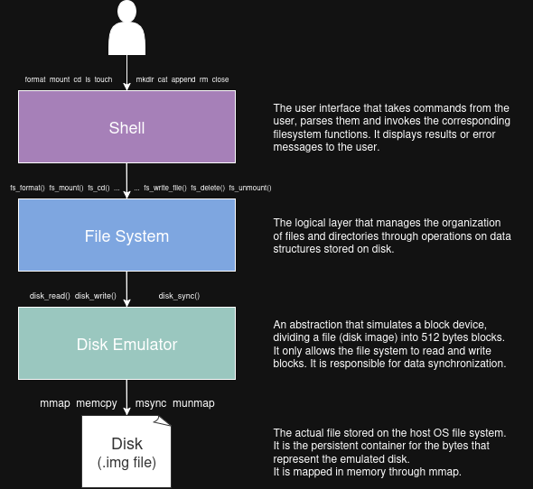

# Unix-like Filesystem with Memory Mapping

This project implements a simple Unix-like filesystem designed for educational purposes.  
The filesystem is persistent and stored inside a disk image file, which is memory-mapped using `mmap`.

## Architecture

The project is structured in layers as illustrated below. Each layer provides a clear abstraction boundary, separating low-level disk operations from higher-level filesystem logic.

## Roadmap

A bottom-up approach is being followed for the incremental implementation of the modules described.

### Completed
- [X] **Disk emulator** (`disk.c`, `disk.h`)
- [X] **Bitmap allocator** for blocks and inodes
- [X] **Superblock module** (initialization, loading, validation)
- [X] **Inode table implementation** (allocation, deallocation, IO, metadata)
- [X] **Directory management** (`dentry.c`): listing, search, add, remove
- [X] **Path resolution module** (normalization, parsing, traversal)
- [X] **Filesystem core** (`fs.c`)
  - mounting / unmounting
  - formatting
  - create / unlink
  - mkdir / rmdir
  - read / write / seek
  - hard links
  - stat & directory listing

### In Progress
- [ ] **Shell interface** (CLI for interacting with the filesystem)
- [ ] **Full test suite** (unit + integration + stress tests)
- [ ] **Time metadata correctness review** (access/modify/create timestamps)

### Planned
- [ ] **Doxygen documentation** for entire codebase
