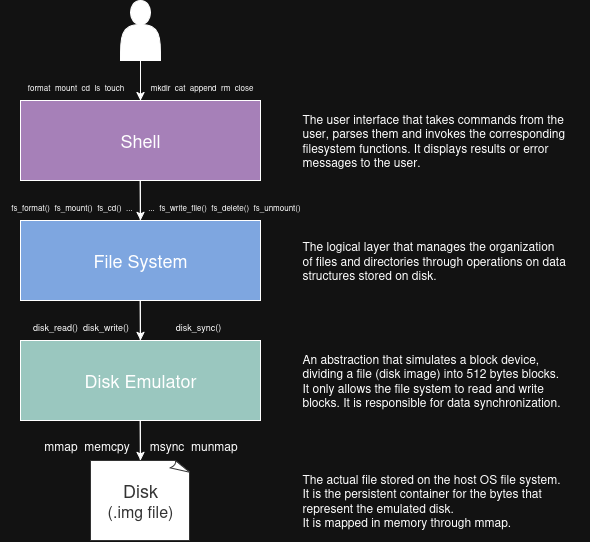

# Unix-like Filesystem with Memory Mapping

This project implements a simple Unix-like filesystem designed for educational purposes.  
The filesystem is persistent and stored inside a disk image file, which is memory-mapped using `mmap`.

## Architecture

The project is structured in layers as shown in the image below:

## Roadmap

- [ ] Implement the **Disk Emulator** module (`disk.c`, `disk.h`)
- [ ] Define filesystem data structures (superblock, inodes, directories)
- [ ] Implement basic filesystem operations (`fs_mkdir`, `fs_touch`, `fs_ls`, ...)
- [ ] Develop the shell interface
